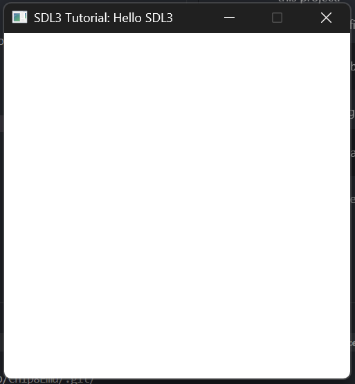

# ACE (Another Chip8 Emulator)
My version of a Chip8 emulator (Also using it to practice CMake)

## Install/Run
1. Clone the project to your computer
2. Ensure you have CMake installed
3. Inside the root directory of the project run:
```cmake
cmake -S . -B build
```
**If you do not have SDL3 Installed, it will be installed and placed in a _deps folder inside this project.**

4. Once the configuration has finished, run:
```cmake
cmake --build build
```
5. Once the program has been built, simply run it, for windows its:
```
.\build\Debug\ace.exe
```
You should be greeted with the following:

<center></>