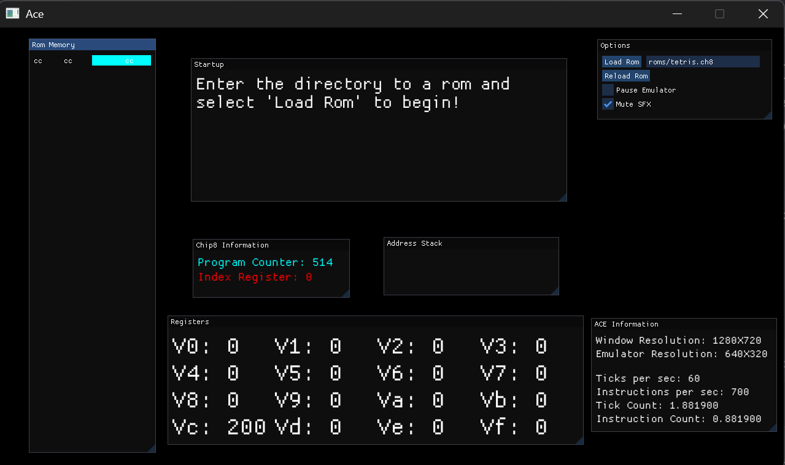

# ACE (Another Chip8 Emulator)
My version of a Chip8 emulator (Also using it to practice CMake)

A big thank you to [this guide](https://tobiasvl.github.io/blog/write-a-chip-8-emulator/) for making the learning process very easy, as well as the various other chip8 reference guides scattered around the internet.

## Controls
There are only 2 extra functions added for convenience sake:
1. 'o' reloads the current Rom to restart it.
2. 'p' is a shortcut for pausing the emulator, press it again to unpause.

Other than that the following keys (left) map to the orignal COSMAC VIP layout (right):


| 1 | 2 | 3 | 4 |     | 1 | 2 | 3 | C |
|---|---|---|---|-----|---|---|---|---|
| Q | W | E | R |     | 4 | 5 | 6 | D |
| A | S | D | F |     | 7 | 8 | 9 | E |
| Z | X | C | V |     | A | 0 | B | F | 

## Install/Run
1. Clone the project to your computer
2. Ensure you have a C++17 complient compiler installed 
3. Ensure you have CMake installed
4. Inside the root directory of the project run:
```cmake
cmake -S . -B build
```
**!The makefile will install SDL3, SDL_Mixer and ImGUi into the project directory even if you already have them downloaded!**

5. Once the configuration has finished, run:
```cmake
cmake --build build
```
6. Once the program has been built, simply run it, for windows its:
```
.\build\Debug\ace.exe 
```
* Or you can click on the Ace.exe file itself

You should be greeted with the following:

<center></>